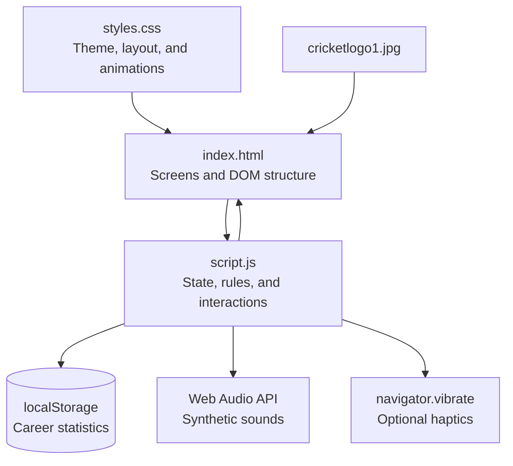
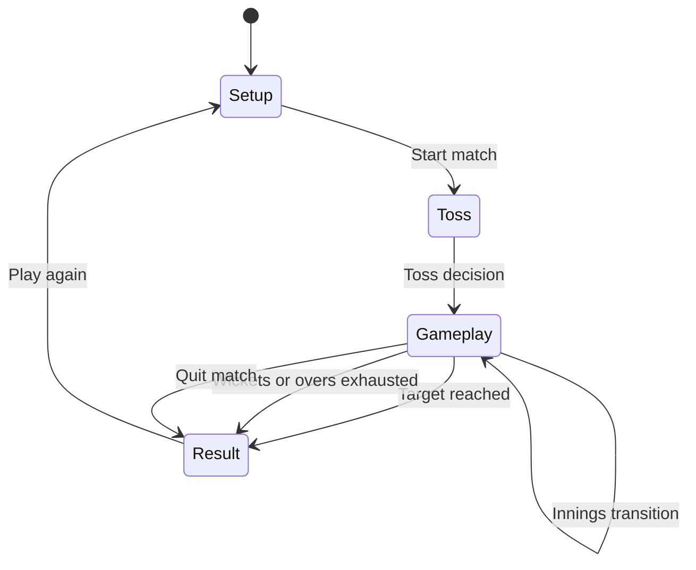
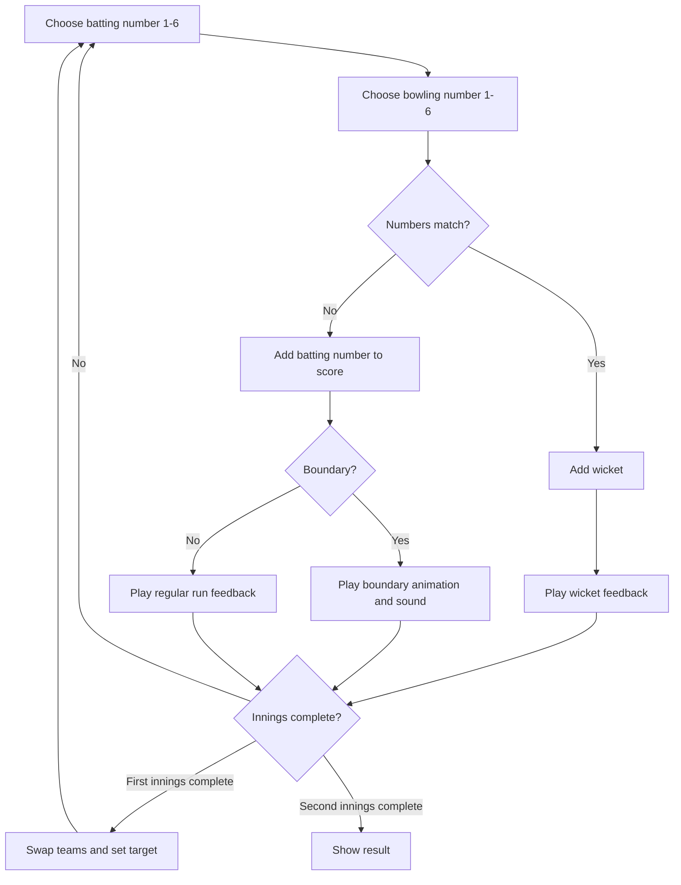

# Hand Cricket

A responsive hand-cricket web game built with vanilla HTML, CSS, and JavaScript.

## Features

- Single-player mode against the CPU.
- CPU difficulty levels: Easy, Medium, and Hard.
- Local two-player pass-and-play mode.
- Custom player names.
- Configurable wickets: 1, 3, 5, or 10.
- Configurable overs: unlimited, 1, 2, or 5 overs.
- Toss system with animated coin flip.
- Batting and bowling decisions from 1 to 6.
- Ball-by-ball score chips and commentary.
- Animated score events for boundaries and wickets.
- Synthetic Web Audio sounds for runs, boundaries, wickets, and victory.
- Optional device vibration for wickets and match victory.
- Quit-match action that awards the win to the opponent.
- Career statistics saved in browser localStorage.
- Responsive dark glassmorphism interface for desktop and mobile.

## Rules

- Both sides select a number from 1 to 6.
- If the numbers are different, the batter scores the selected batting number.
- If the numbers match, the batter is out.
- The first innings sets a target of first-innings score plus one.
- The second innings ends when the target is reached, wickets fall, or the overs limit expires.

## System Architecture

The application is a client-side web app. It has no backend, database server,
build step, or framework dependency.



### Architecture Layers

#### Presentation layer

`index.html` contains the four main screens and reusable UI regions:

- Setup screen
- Toss screen
- Gameplay screen
- Result screen
- Career statistics drawer
- Delivery animation overlay

`styles.css` provides the responsive dark glassmorphism design system,
typography, score animations, toss animation, keypad states, boundary flashes,
and wicket feedback.

#### Application layer

`script.js` acts as the application controller and rules engine. It manages
screen transitions, user input, CPU decisions, innings changes, rendering,
audio, haptics, and localStorage persistence.

#### Asset layer

`cricketlogo1.jpg` is used as the application header logo. It is loaded locally
and does not require a server or asset pipeline.

## Screen Flow



## Game State

The current match is represented by one central `game` object. This keeps the
scoreboard, innings logic, commentary, animations, and result screen in sync.

```js
{
	innings: 1,
	batTeam: "p1",
	bowlTeam: "p2",
	target: null,
	feed: [],
	chips: [],
	recentMoves: [],
	waitingPass: false,
	teams: {
		p1: { name: "Player 1", score: 0, wickets: 0, balls: 0 },
		p2: { name: "CPU", score: 0, wickets: 0, balls: 0 }
	}
}
```

Match configuration is kept separately:

```js
{
	mode: "cpu",
	difficulty: "easy",
	wickets: 3,
	overs: 0
}
```

## Delivery Processing



## Main JavaScript Responsibilities

| Function         | Responsibility                                                 |
| ---------------- | -------------------------------------------------------------- |
| `startMatch()`   | Creates a new match and initializes named teams                |
| `resetToss()`    | Restores the coin, calls, and Flip coin button                 |
| `beginInnings()` | Assigns batting and bowling teams after the toss               |
| `renderGame()`   | Updates scores, targets, innings labels, chips, and commentary |
| `chooseMove()`   | Handles player keypad input and pass-and-play turns            |
| `cpuMove()`      | Generates Easy, Medium, and Hard CPU moves                     |
| `playBall()`     | Applies scoring, wickets, animations, and innings rules        |
| `finish()`       | Records the winner and ends the match                          |
| `quitMatch()`    | Awards the match to the opponent when a player quits           |
| `renderResult()` | Displays the final scorecard and career summary                |
| `sound()`        | Generates synthetic game sounds using Web Audio                |
| `saveStats()`    | Persists career statistics to localStorage                     |
| `renderStats()`  | Renders the career statistics drawer and result stats          |

## Data and Persistence

Career statistics use the localStorage key:

```text
handCricketStats
```

Stored values include:

- Matches played
- Wins versus CPU
- Losses versus CPU
- Highest individual score
- Total boundaries

Statistics are device and browser specific. Clearing browser site data removes
the saved record.

## Audio and Interaction Feedback

- Regular runs use a short synthesized blip.
- Fours and sixes use ascending tones and boundary flashes.
- Wickets use a low buzz, wicket scene, crimson flash, and optional vibration.
- Match victory uses a triumph sound and optional vibration.
- Browser audio begins after a user gesture due to autoplay restrictions.

## Browser Compatibility

The app works in current versions of Chrome, Edge, Firefox, and Safari. The
following capabilities are optional and degrade gracefully when unavailable:

- Web Audio API
- `navigator.vibrate()`
- CSS backdrop blur

## Project Structure

```text
CricketGame/
|-- index.html          Page structure and screens
|-- styles.css          Responsive styling and animations
|-- script.js           Game state, rules, audio, and localStorage
|-- cricketlogo1.jpg    Header logo image
|-- README.md           Project documentation
```

## Run Locally

No build tools or package installation are required.

1. Open the project folder in VS Code.
2. Open `index.html` in a browser.
3. Start a match from the setup screen.

For the best experience, use a modern browser such as Chrome, Edge, Firefox, or Safari. Audio is enabled after the first user interaction because of browser autoplay policies.

## Controls

- Choose a game mode and match settings.
- Enter player names before starting.
- Select Heads or Tails, then flip the coin.
- Choose Bat first or Bowl first when the toss is won.
- Select a number from 1 to 6 during gameplay.
- In two-player mode, pass the device when prompted.
- Use Quit match to concede the current game.
- Use Career stats to view or reset saved statistics.

## Data Storage

Career statistics are stored locally in the browser under the `handCricketStats` localStorage key. Clearing browser site data will remove the saved statistics.

## Browser APIs Used

- Web Audio API for generated game sounds.
- `navigator.vibrate()` when supported by the device.
- `localStorage` for career statistics.
